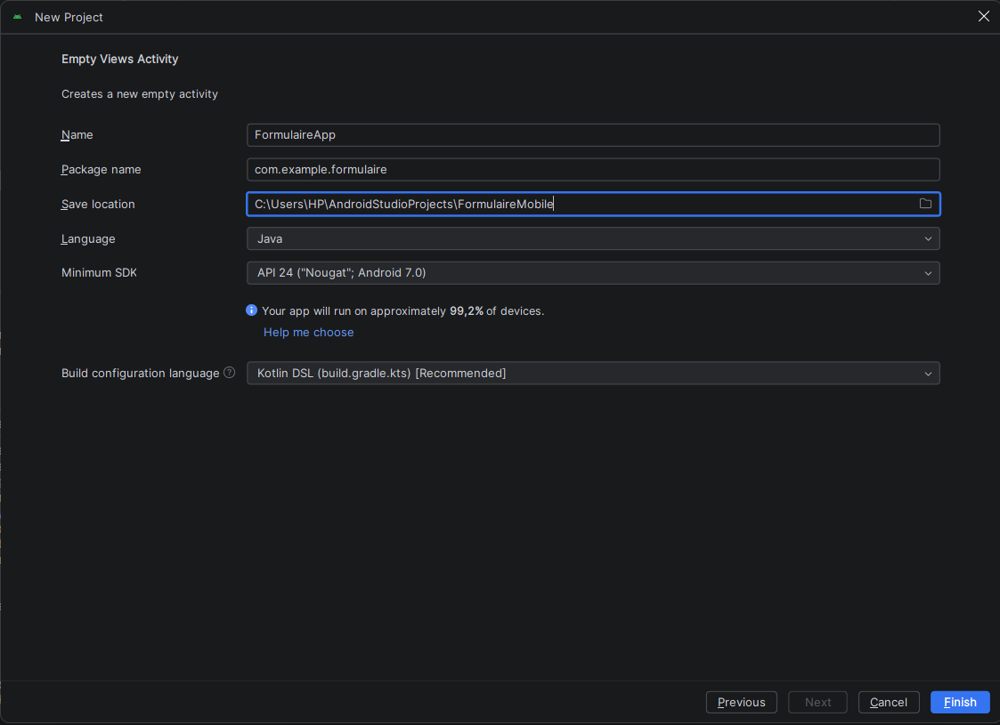
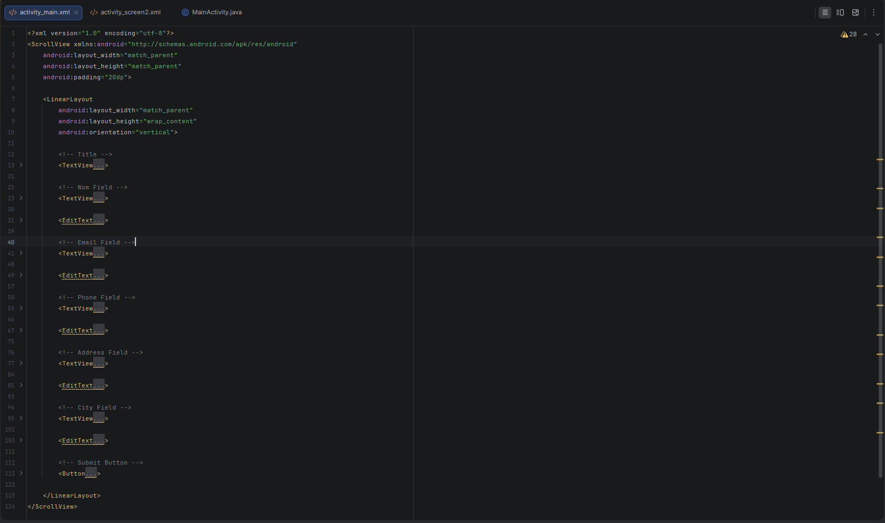
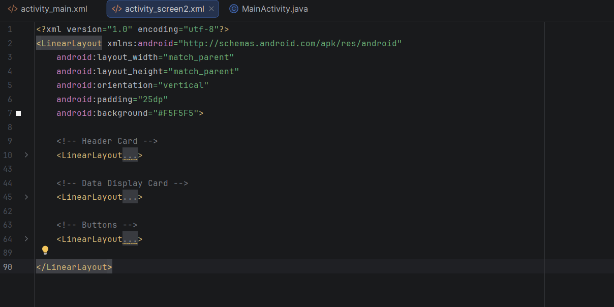
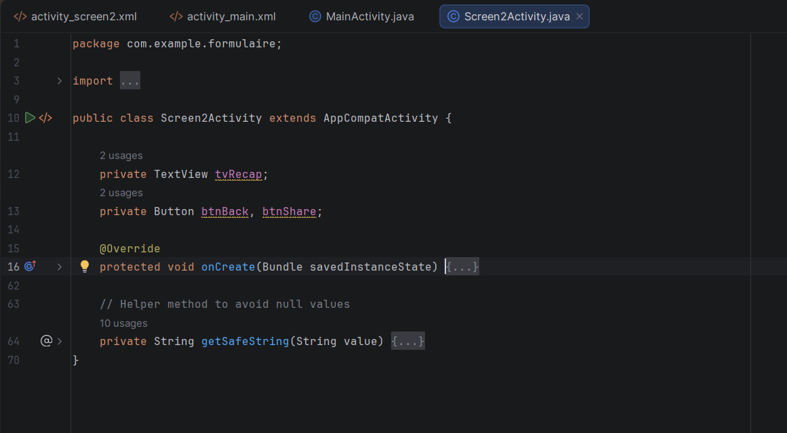
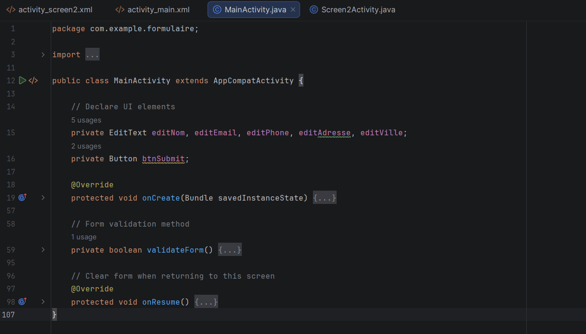
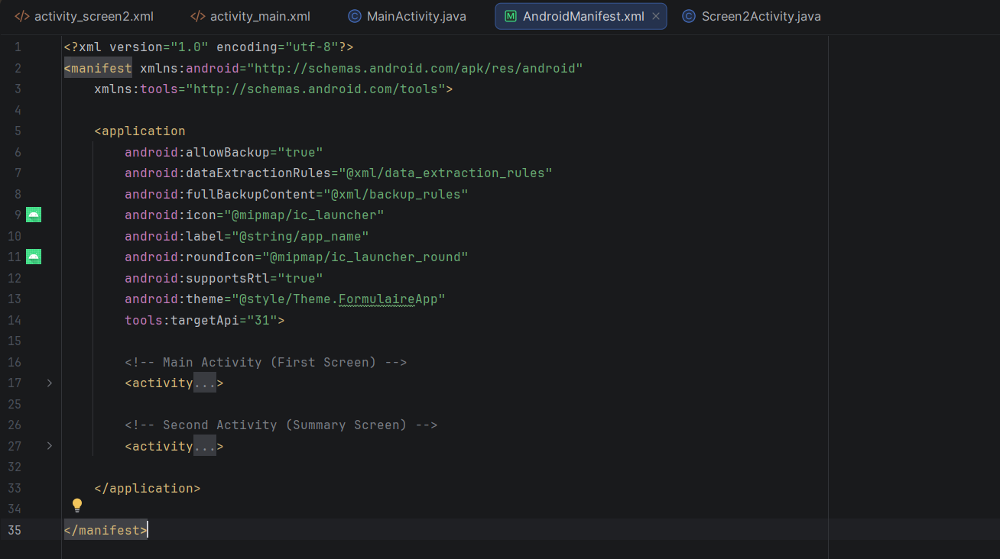
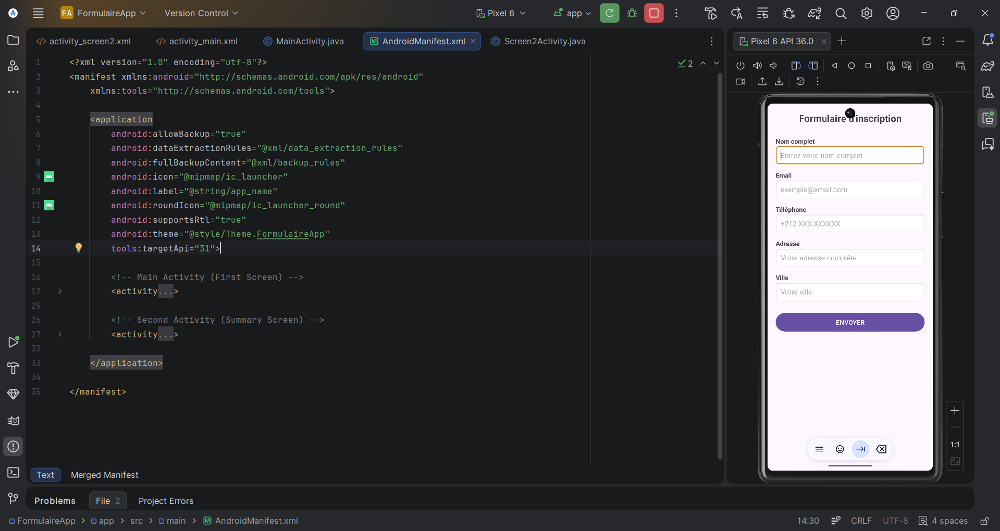
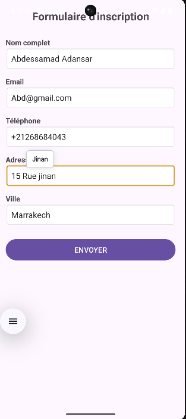
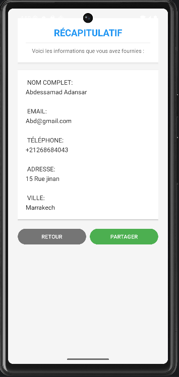

# 📱 Application Formulaire Android

## 📋 Description
Application Android développée dans le cadre du **Lab 3** du cours "Programmation Mobile Android avec Java".  
L'application permet de saisir des informations personnelles via un formulaire et de les afficher sur un écran récapitulatif.

## 🎯 Objectifs pédagogiques
- Création d'interfaces avec **ScrollView** et **LinearLayout**
- Utilisation des composants UI (**EditText**, **TextView**, **Button**)
- Navigation entre activités avec **Intent explicite**
- Transfert de données avec **putExtra() / getStringExtra()**
- Gestion du cycle de vie (**finish()**, **onResume()**)

## 📸 Captures d'écran

### Étape 1: Création du projet

### Étape 2: Interface du formulaire (activity_main.xml)

### Étape 3: Interface du récapitulatif (activity_screen2.xml)

### Étape 4: Code Java - Screen2Activity

### Étape 5: Code Java - MainActivity

### Étape 6: AndroidManifest.xml

### Étape 7: Application en cours d'exécution

## 🏗️ Structure du projet
app/
├── manifests/
│ └── AndroidManifest.xml
├── java/
│ └── com.example.formulaire/
│ ├── MainActivity.java
│ └── Screen2Activity.java
└── res/
└── layout/
├── activity_main.xml
└── activity_screen2.xml
